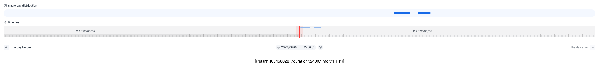

<div align="center"> <a href="https://github.com/corerain/timeline">  </a> <br> <br>

[](LICENSE)

<h1>TimeLine</h1>
</div>

**English** | [中文](./docs/README.zh-CN.md)

## Introduction

record the data in timeline

## Live Demos

https://corerain.github.io/time-line/

<p align="center">
    
</p>


Use TimeLine:

### Base use:
``` html
<div id="day-line"></div>
<div id="time-line"></div>
```

``` js
  import TimeLine from './build/timeline.js'
  ...
    const option = {
      container: document.querySelector('#time-line'),
      dayContainer: document.querySelector('#day-line'),
      pointerColor: 'rgba(255, 58, 51, 1)',
      record: []
    }

    const timeline = new TimeLine(option)
  ...
```

## Props

|Name|Description|Type|Required|Default|
|---|---|---|---|---|
|container|timeline fafther Element|`HtmlElement`|`true`|null|-|
|backgroundColor|timeline background color|`String`|`false`|rgba(14, 27, 46, .05)|-|
|dayContainer|dayline fafther Element|`HtmlElement`|`false`|null|-|
|dayBackgroundColor|dayline background color|`String`|`false`|rgba(245, 249, 255, 1)|-|
|dayBackgroundPadding|dayline line left and right padding|`Number`|`false`|10|-|
|dayBackgroundShape|dayline background shape|`String`|`false`|round|-|
|dayRecordLineHeight|dayline line height|`Number`|`false`|2|-|
|dayRecordlineColor|dayline line color|`String`|`false`|rgba(218, 227, 240, 1)|-|
|dayRecordHeight|dayline record height|`Number`|`false`|12|-|
|dayRecordColor|dayline record color|`String`|`false`|rgba(24, 114, 240, 1)|-|
|dayAnimationTimer|dayline animation duration|`Number`|`false`|1|-|
|dayAnimationEase|dayline animation timing function|`String`|`false`|easeInOutQuart|-|
|secondPixelRatio|tick marks second pixel ratio|`Number`|`false`|1|1/2/3/4/5/6/10/12/15/20/30/60|
|pointerColor|pointer color|`String`|`false`|rgba(27, 53, 89, 1)|-|
|pointBlockScope|pointer block half scope|`Number`|`false`|14.5|-|
|pointBlockBackgroundColor|pointer scope background color|`String`|`false`|rgba(255, 58, 51, .1)|-|
|shortHeight|short tick marks height|`Number`|`false`|8|-|
|shortColor|short tick marks color|`String`|`false`|rgba(200, 202, 204, 1)|-|
|middleHeight|middle tick marks height|`Number`|`false`|12|-|
|middleColor|middle tick marks color|`String`|`false`|rgba(200, 202, 204, 1)|-|
|longHeight|long tick marks height|`Number`|`false`|16|-|
|longColor|long tick marks color|`String`|`false`|rgba(150, 151, 153, 1)|-|
|zeroBottom|timeline day zero away from the tick mark height|`Number`|`false`|6|-|
|zeroColor|timeline day zero triangle color|`String`|`false`|rgba(14, 27, 46, .65)|-|
|zeroRadian|timeline day zero triangle angle|`Number`|`false`|60|-|
|fontSize|timeline day zero font size|`Number`|`false`|12|-|
|fontFamily|timeline day zero font family|`String`|`false`|sans-serif|-|
|fontWeight|timeline day zero font weight|`Number`|`false`|600|-|
|zeroFormat|timeline day zero time format|`String`|`false`|YYYY/MM/DD|-|
|extent|timeline mouse scroll extent|`Number`|`false`|6|-|
|record|timeline record data|`Array`|`false`|[]|-|
|recordTop|timeline record away from top|`Number`|`false`|4|-|
|recordRadius|timeline record radius|`Number`|`false`|3|-|
|recordColor|timeline record color|`String`|`false`|rgba(156, 191, 240, 1)|-|
|clockHeight|now block height|`Number`|`false`|16|-|


## Events

|Event Name|Description|Parameters|
|---|---|---|
|getPointerTimeInfo|get pointer time info|-|
|pixelToTime|change pixel to time|pixel(Number)|
|timeToPixel|change time to pixel|time(dayjs Object)|
|jumpTime|jump to time|time(dayjs Object | unix)|
|dispose|dipose timeline object|-|

## License

Copyright (C) 2022 Corerain. All Rights Reserved.

Licensed under the Apache License, Version 2.0 (the "License");
you may not use this file except in compliance with the License.
You may obtain a copy of the License at

    http://www.apache.org/licenses/LICENSE-2.0

Unless required by applicable law or agreed to in writing, software
distributed under the License is distributed on an "AS IS" BASIS,
WITHOUT WARRANTIES OR CONDITIONS OF ANY KIND, either express or implied.
See the License for the specific language governing permissions and
limitations under the License.

